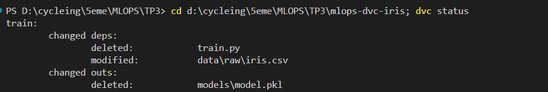
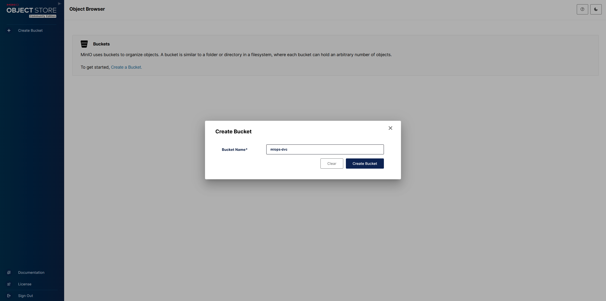

# TP3 : Data Versioning avec DVC

## 📋 Description
Ce projet démontre l'utilisation de **DVC (Data Version Control)** pour versionner des datasets avec **MinIO** comme stockage S3 local.

## 🎯 Objectifs réalisés
- ✅ Versionner le dataset `iris.csv` avec DVC
- ✅ Utiliser MinIO comme remote S3 local pour les blobs DVC
- ✅ Assurer la reproductibilité du projet

---

## 🛠️ Installation et Configuration

### 1. Prérequis
```bash
# Installer DVC avec support S3
pip install "dvc[s3]"

# Docker et Docker Compose installés
```

### 2. Lancer MinIO
```bash
docker compose up -d
```
- Console Web : http://localhost:9001
- Credentials : `minio` / `minio12345`
- Bucket créé : `mlops-dvc`

### 3. Initialisation DVC
```bash
# Initialiser DVC
dvc init

# Ajouter le dataset au suivi DVC
dvc add data/raw/iris.csv

# Committer les fichiers générés
git add data/raw/iris.csv.dvc data/raw/.gitignore .dvc/
git commit -m "Add iris.csv to DVC tracking"
```

### 4. Configuration du Remote S3 (MinIO)
```bash
# Ajouter le remote
dvc remote add -d storage s3://mlops-dvc

# Configurer MinIO
dvc remote modify storage endpointurl http://localhost:9000
dvc remote modify storage use_ssl false
dvc remote modify storage region us-east-1
dvc remote modify storage access_key_id minio
dvc remote modify storage secret_access_key minio12345

# Committer la configuration
git add .dvc/config
git commit -m "Configure DVC remote storage with MinIO"
```

### 5. Synchronisation avec MinIO
```bash
# Pousser les données vers MinIO
dvc push
```

---

## 📸 Captures d'écran - Vérifications

### 1. DVC Status (Local)
Vérification du statut local après `dvc add` :



**Commande :**
```bash
dvc status
```

---

### 2. DVC Status Cloud (Après Push)
Vérification de la synchronisation avec MinIO après `dvc push` :


**Commande :**
```bash
dvc status --cloud
```

**Résultat attendu :** `Cache and remote 'storage' are in sync.`

---

### 3. MinIO Console - Bucket
Vérification du bucket et des fichiers dans MinIO :



Console MinIO accessible sur : http://localhost:9001

---

## 🔄 Reproductibilité

Pour reproduire le projet sur une autre machine :

```bash
# 1. Cloner le repository
git clone https://github.com/AymenMB/mlops-dvc-iris.git
cd mlops-dvc-iris

# 2. Lancer MinIO (si nécessaire)
docker compose up -d

# 3. Récupérer les données depuis MinIO
dvc pull
```

Les données seront automatiquement téléchargées depuis le remote S3 (MinIO) !

---

## 📁 Structure du Projet

```
mlops-dvc-iris/
├── .dvc/                      # Configuration DVC
│   ├── config                 # Configuration du remote S3
│   └── .gitignore
├── data/
│   └── raw/
│       ├── iris.csv           # Dataset (non versionné dans Git)
│       ├── iris.csv.dvc       # Metadata DVC (versionné dans Git)
│       └── .gitignore
├── src/
│   └── train.py              # Script d'entraînement
├── docker-compose.yml        # Configuration MinIO
├── dvc.yaml                  # Pipeline DVC
└── README.md
```

---

## 🔑 Points Clés

### Fichiers versionnés dans Git
- ✅ `data/raw/iris.csv.dvc` (metadata DVC)
- ✅ `.dvc/config` (configuration remote)
- ✅ `.dvc/.gitignore`
- ✅ `data/raw/.gitignore`
- ✅ Code source (`src/*.py`)
- ✅ `dvc.yaml`, `dvc.lock`, `params.yaml`

### Fichiers NON versionnés dans Git
- ❌ `data/raw/iris.csv` (le dataset réel)
- ❌ Dossier `.dvc/cache/`
- ❌ Modèles générés

**Principe** : Git ne versionne que les petits fichiers et métadonnées, DVC gère les gros fichiers et les stocke dans MinIO.

---

## 🧪 Commandes Utiles

```bash
# Vérifier le statut local
dvc status

# Vérifier la synchronisation avec le remote
dvc status --cloud

# Pousser les données vers le remote
dvc push

# Récupérer les données depuis le remote
dvc pull

# Voir les différences entre versions
dvc diff <base> <head>

# Visualiser le pipeline (si défini)
dvc dag

# Sanity check de l'environnement
dvc doctor
```

---

## 👨‍💻 Auteur
**Aymen MB**

## 📚 Technologies Utilisées
- **DVC** - Data Version Control
- **MinIO** - S3-compatible object storage
- **Docker** - Containerization
- **Git** - Version control
- **Python** - Programming language

---

## 📝 Livrables

- ✅ Repository GitHub : https://github.com/AymenMB/mlops-dvc-iris
- ✅ Captures d'écran : `dvc status` (local)
- ✅ Captures d'écran : `dvc status --cloud` (après push)
- ✅ Configuration MinIO fonctionnelle
- ✅ Reproductibilité assurée avec `dvc pull`
